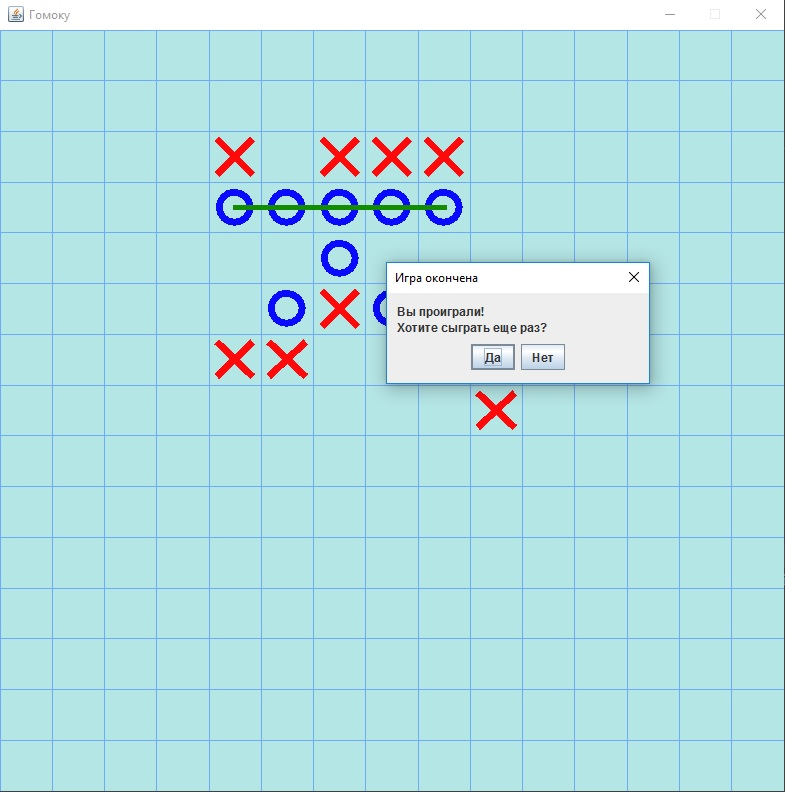
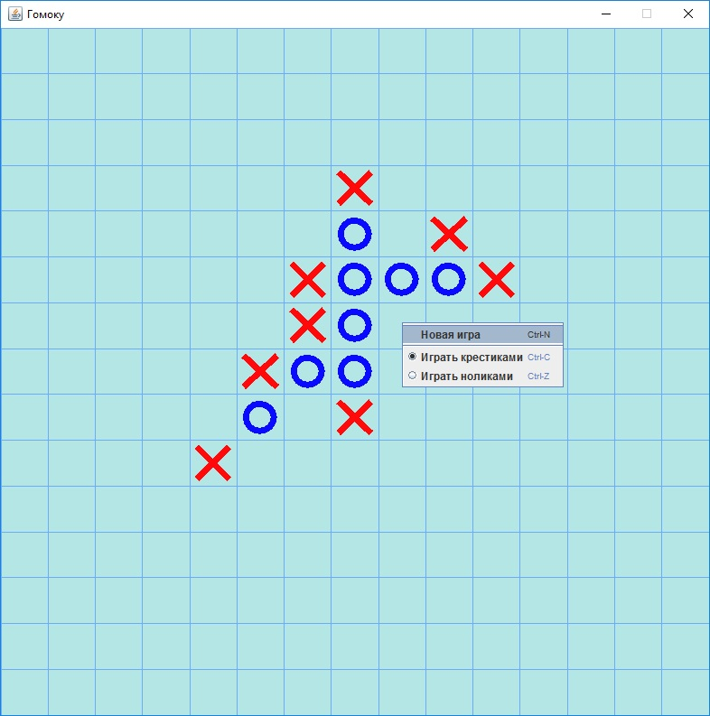
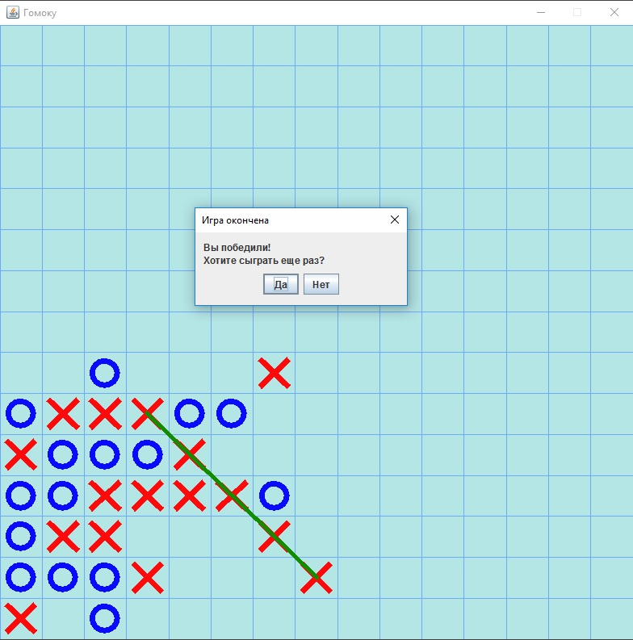

# GomokuGame
Игра "Крестики-нолики по пять в ряд"

Данный проект представляет собой реализацию простой игры "по пять в ряд". Можно играть как крестиками, так и ноликами,
на ходу переключаясь между ними с помощью всплывающего меню. В игре реализована довольно сильная логика. Компьютер видит
"вилки", может сам их ставить и предотвращать "вилки" от игрока. В целом, победить его довольно сложно, но возможно.

